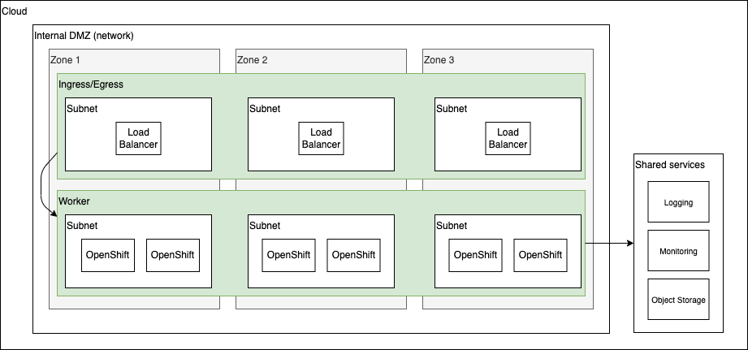
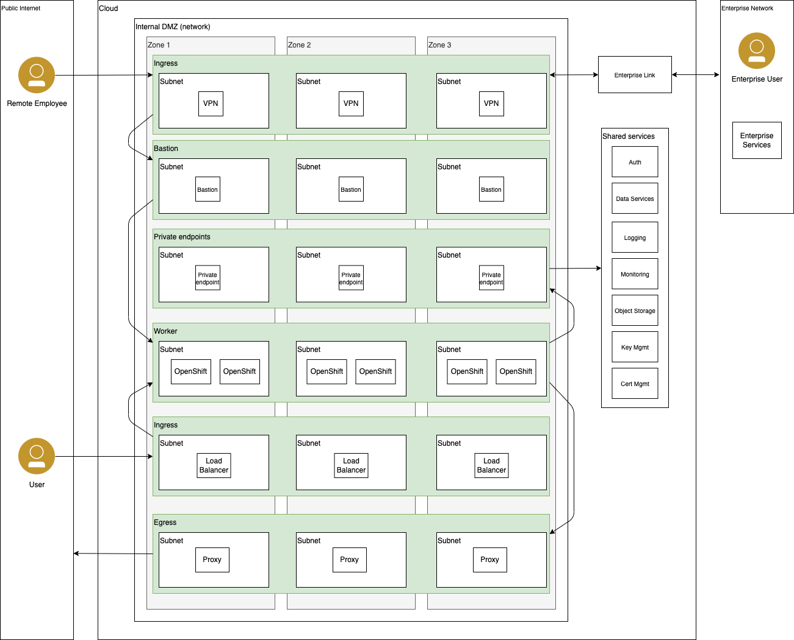
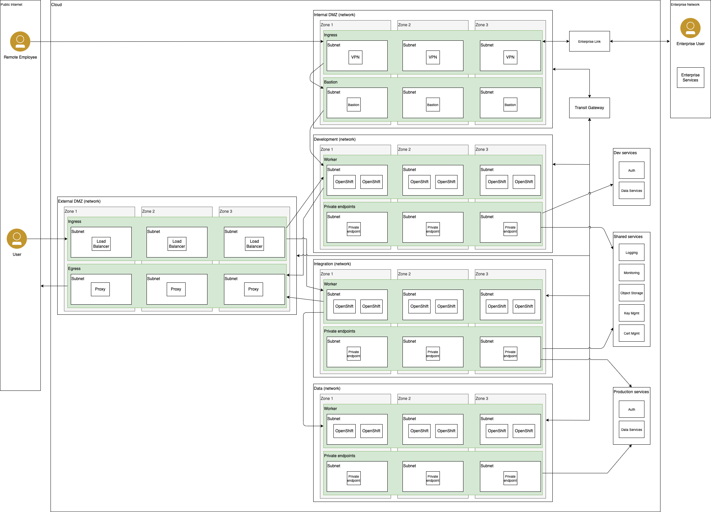

# TechZone Automation - Reference Architectures

The reference architectures are provided in three different forms, with increasing security and associated complexity. These three forms are:

- **Quick Start** - a simple architecture to quickly get an OpenShift cluster provisioned
- **Standard** - a standard production deployment environment with typical security protections, private endpoints, VPN server, key management encryption, etc
- **Advanced** - a more advanced deployment that employs network isolation to securely route traffic between the different layers.

For each of these reference architecture forms, we have provided a detailed reference architecture on the different hyper-scalers.

|                        | Quick Start                                              | Standard                                            | Advanced                                            | Source diagram                                           | 
|------------------------|----------------------------------------------------------|-----------------------------------------------------|-----------------------------------------------------|----------------------------------------------------------|
| [IBM Cloud](ibmcloud/) | [IBM Cloud Quick Start](ibmcloud/ibmcloud-quickstart.md) | [IBM Cloud Standard](ibmcloud/ibmcloud-standard.md) | [IBM Cloud Advanced](ibmcloud/ibmcloud-advanced.md) | [IBM Cloud arch](ibmcloud/ibm-cloud-architecture.drawio) |
| [AWS](aws/)            | [AWS Quick Start](aws/aws-quickstart.md)                 | [AWS Standard](aws/aws-standard.md)                 | [AWS Advanced](aws/aws-advanced.md)                 | [AWS arch](aws/aws-cloud-architecture-0.7.drawio)        |
| [Azure](azure/)        | [Azure Quick Start](azure/azure-quickstart.md)           | [Azure Standard](azure/azure-standard.md)           | [Azure Advanced](azure/azure-advanced.md)           | [Azure arch](azure/azure-ref-arch.drawio)                |

## Architectures

### QuickStart

#### Requirements/Features

- Single VPC/Vnet
    - Minimal subnets to support the OpenShift cluster (one or two depending on the requirements of the cloud provider)
    - Outbound access to the public internet
- OpenShift cluster
    - Default worker node sized to support Cloud Pak deployments (16x64)
    - Default to multi-zone deployments
    - Default to one node per zone
- Shared services for Log Aggregation, Monitoring, and Object Storage

### Standard

#### Requirements/Features

- Single VPC/Vnet
- Isolate network traffic in different subnets
    - Management ingress subnet with VPN/secure access to separate network
    - Bastion subnets with access to the public internet(?)
    - Egress subnets with access to the public internet and proxy servers
    - Consumer ingress subnet with public endpoints to allow access to cluster endpoints
    - OpenShift cluster subnets with no direct access to the internet
    - Private Endpoint subnets that connect the VPC network to the shared services
- OpenShift cluster with private endpoints and cluster-wide proxy configured
    - Default worker node sized to support Cloud Pak deployments (16x64)
    - Default to multi-zone deployments
    - Default to two nodes per zone
- Support for multiple clusters if necessary (to support isolated Cloud Pak deployments)
- Key Management provisioned and encryption provided for all services
- Shared services for Log Aggregation, Monitoring, and Object Storage via private endpoints

### Advanced

#### Requirements/Features

- Multiple VPC/Vnets to isolate network traffic
    - Internal DMZ (for management traffic)
    - External DMZ (for consumer access)
    - Development network
    - Production network(s)
- Transit gateway to navigate between VPCs
- Isolate network traffic in different subnets, distributed across the VPCs
    - Management ingress subnet with VPN/secure access to separate network
    - Bastion subnets with access to the public internet(?)
    - Egress subnets with access to the public internet and proxy servers
    - Consumer ingress subnet with public endpoints to allow access to cluster endpoints
    - OpenShift cluster subnets with no direct access to the internet
    - Private Endpoint subnets that connect the VPC network to the shared services
- OpenShift cluster with private endpoints and cluster-wide proxy configured
    - Default worker node sized to support Cloud Pak deployments (16x64)
    - Default to multi-zone deployments
    - Default to two nodes per zone
- Additional clusters are provisioned in their own VPC
- Key Management provisioned and encryption provided for all services
- Shared services for Log Aggregation, Monitoring, and Object Storage via private endpoints

## Feature Comparison

| Area           | Description                                                                                     | Quickstart | Standard | Advanced |
|----------------|-------------------------------------------------------------------------------------------------|------------|----------|----------|
| Availability   | Single node per zone where available by cloud provider                                          | Must       | -        | -        |
|                | Multi-zone deployment where supported by cloud provider                                         | Could      | Must     | Must     |
|                | 2 nodes per zone where availabile by cloud provider                                             | -          | Must     | Must     |
| Cost           | Be low cost to run                                                                              | Must       | Could    | Could    |
| Functionality  | Provide access to public cloud storage                                                          | Should     | Should   | Should   |
|                | Provide load balancing to OpenShift cluster/s                                                   | Should     | Must     | Must     |
|                | Provide NAT gateway egress                                                                      | Should     | Could    | Could    |
|                | Provide access to public cloud DNS                                                              | Must       | Must     | Should   |
|                | Provide an OpenShift cluster                                                                    | Must       | Must     | Must     |
|                | Shared services for log aggregation                                                             | Must       | Must     | Must     |
|                | Shared services for Monitoring                                                                  | Must       | Must     | Must     |
|                | Shared services for Object Storage                                                              | Must       | Must     | Must     |
|                | Provide a public DNS entry for the OpenShift console                                            | Must       | Could    | Could    |
|                | Provide internet accessability                                                                  | Must       | Could    | Could    |
|                | Ability to deploy virtual storage (like portworx or ODF)                                        | Could      | Should   | Should   |
|                | Consumer ingress subnet with public endpoints to allow access to cluster endpoints              | Could      | Should   | Should   |
|                | Management ingress subnet with VPN/secure access                                                | Could      | Should   | Must     |
|                | Provide a private DNS entry for the OpenShift console                                           | Could      | Should   | Must     |
|                | Provide VPN client connectivity                                                                 | Could      | Should   | Must     |
|                | Private endpoint subnet connections to shared services                                          | Could      | Must     | Must     |
|                | Provide VPN site-to-site gateway connectivity                                                   | Could      | Could    | Should   |
|                | Provide connectivity from public cloud to client site                                           | Could      | Could    | Could    |
|                | Proxy service for public ingress                                                                | Could      | Could    | Could    |
|                | Provide internal/private clusters                                                               | -          | Should   | Must     |
|                | Support for mulitple OpenShift clusters                                                         | -          | Should   | Must     |
|                | Key management provisioned                                                                      | -          | Must     | Must     |
|                | Provide multiple OpenShift clusters                                                             | -          | -        | Should   |
|                | Additional clusters in their own VPCs/Vnets                                                     | -          | -        | Must     |
|                | Provide a virtual private cloud / network for OpenShift cluster/s                               | -          | -        | Must     |
|                | Provide connectivity within the public cloud between multiple virtual private clouds / networks | -          | -        | Must     |
|                | Provide multiple virtual private clouds / networks to isolate network traffic                   | -          | -        | Must     |
| Implementation | Provide ability to rapidly implement and destroy                                                | Must       | Should   | Could    |
|                | Be simple to deploy                                                                             | Must       | Must     | Must     |
| Scalability    | Worker node sized to support Cloud Pak deployments (16x64)                                      | Must       | Must     | -        |
|                | Provide throughput to support production traffic                                                | -          | Could    | Must     |
| Security       | Bastion subnets with access to public internet                                                  | Could      | Should   | Must     |
|                | OpenShift cluster subnets with no direct access to the internet                                 | -          | Should   | Must     |
|                | Encryption provided for all services                                                            | -          | Must     | Must     |
|                | Provide network access firewalling                                                              | -          | Could    | Should   |
|                | Provide network ACL security                                                                    | -          | Could    | Should   |
|                | Provide network interface firewalling                                                           | -          | Could    | Should   |
|                | External DMZ for consumer access                                                                | -          | -        | Should   |
|                | Internal DMZ for management traffic                                                             | -          | -        | Should   |
|                | Provide separate DMZ                                                                            | -          | -        | Must     |
| Supportability | Provide Red Hat console management                                                              | Should     | Should   | Should   |
